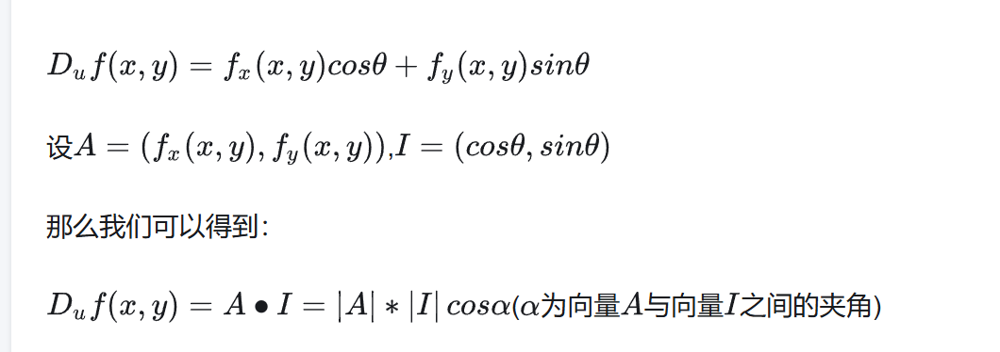

- 梯度下降算法
  - 梯度方向定义为**该点方向导数最大的方向**。注意该导数是带符号的，换句话说，**二维函数来说，在最小值的左边，其方向为负值。**
  - **梯度方向是函数变化率最大的方向了！！！（因为本来就是把这个函数变化最大的方向命名为梯度）**这个变化方向是可能是高维空间中的任意方向，cosa要为1（-1），夹角要为0（180）.
  - 

- 损失函数系列：

  - 均方差与交叉熵：

    使用平方误差损失函数，误差增大参数的梯度会增大，但是当误差很大时，参数的梯度就会又减小了。
    使用交叉熵损失是函数，误差越大参数的梯度也越大，能够快速收敛。

  - 为什么用交叉熵：

    - 训练角度不用均方差：损失梯度问题

    - 极大似然估计：处理模型已定、参数未知，最大化已有样本概率，则优化目标函数恰好就是交叉熵公式。
    - 分布度量优化目标

- 分布、KL散度和交叉熵

  - 衡量两个分布距离的变量应该具有非对称性，因为参照系（期望）不一样，对于距离的描述/感受也就不一样|？统一参照系不可以吗。

  ，应该是说我们对于张三和李四买土鸡蛋的期望不同，可能张三天天买2个土鸡蛋，而李四可能因为孩子满月昨天才买了6个土鸡蛋，而平时从来不买。